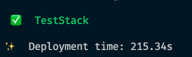

# Amplify CDK Fullstack: Initial Experience

## Description

This is my first time working with the `agqlac` module. My understanding is that this package brings an Amplify-like experience to the CDK by making use of directives like `@model`, `@hasMany` etc. In addition, this will leverage the GraphQL Transform tool to inspect a schema and automatically create CRUDL opeations based on the schema.

## Branch Purpose

This branch will be used to see what the getting started experience is like. Refer to the other branches to best see what it looks like building a full application.

Branch Projects:

1. Todo App ⬅️ You are here. Difficulty: Basic
2. Trip Logger App. Difficulty: Medium
3. MicroSaaS App. Difficulty: Advanced

## Assumptions/Concerns

Before diving in, I'm curious of the following:

- **How well** does the schema inspection and code generation work.
- **Understanding** what the L3 construct does and how customers are expected to use it.
- **What can I ask the team** to enhance/better document. As an L3 construct, what are the baked in opinions and the things that would make a customer use something else (this will be ongoing)
- **Concern**: Will this be updated frequently? What will we do to ensure it keeps up with weekly CDK rollouts?
- **Concern**: What does intellsense look like?

---

## Project Understanding

I started by installing the dependencies:
`npm i`

Before running commands, I reviewed the project structure and came to the following understanding:

- This is a monorepo: CDK backend with CRA frontend
- The `scripts/generate.mjs` file is used to essentially call the Amplify CLI (`npx @aws-amplify/cli codegen add`) and create the `schema.graphqlconfig.yml` file. My assumption is that this will end up being tucked away as a separate package or internal script when this is all finalized.
- The `backend/app.ts` file creates a stack, and an AppSync API. This API has 4 Datasources: 3 as DynamoDB Tables and 1 as a Lambda Function (stubbed out in `backend/repeat.ts`). Looks like the schema is defined inline.
- The `src` directory is the Create React App frontend and is written in TypeScript that makes use of Amplify Generics, UI Library, and yet-to-be-generated operations.
- Instead of an `aws-exports.js` file, it looks like there is a `./appConfig` file. I like this naming.

## Getting Started

### Backend Deployment

Hmmm...I'm actually not sure where to start here. The `README.md` file asks for there to be `amplify` version >=12 installed. It's worth noting that most CDK users don't want to use the Amplify CLI and will instead opt to run Amplify commands from `npx`.

I'm going to follow the `README` and run the `deploy` script.

> I'm using my personal AWS account and also opting to use SSO instead of a straight up AWS account.

`npm run deploy`

Failed to deploy

> Error: Unable to resolve AWS account to use. It must be either configured when you define your CDK Stack, or through the environment

Simple enough. I rely on an AWS profile instead of a `default` account so I have to hardcode those values. But this is the first difference: As a CDK user, I'm used to having a `bin` directory, and a `lib` directory. This begs the question:

> _Who is the target persona here?_ Someone in between Amplify and the CDK in terms of experience? A fullstack dev that wants more control than what Amplify CLI delivers but finds creating an API verbose? Not sure. An error like this would need someone familiar with the CDK.

In future branches I'll likely create a `bin` and a `lib` but for now, I'll keep it the same. I updated the following files and reran the command.

```diff
// app.ts
const app = new cdk.App()
const stack = new cdk.Stack(app, 'TestStack', {
+	env: {
+		account: '842537737558',
+		region: 'us-east-1',
+	},
})
```

```diff
// package.json
- "deploy": "cdk deploy"
- "deploy": "cdk deploy --profile focus-otter-sandbox"
```

```sh
npm run deploy
```

Once deployed, I was able to see a familiar CDK-style deploy confirmation and relevant CloudFormation output in my terminal.



The nice thing here is that I get my expected output: AppSync endpoint, API ID, and API Key.

So far so good.

### Frontend Deployment
